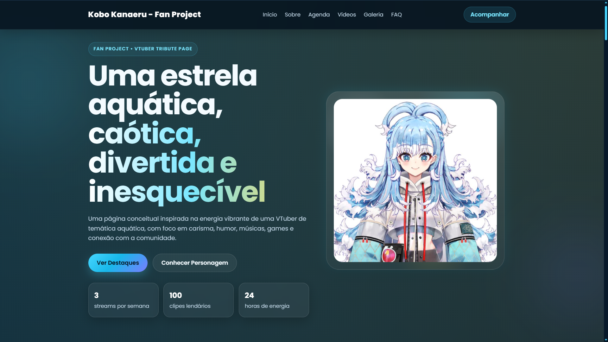

# 🌊 Aqua Idol — VTuber Tribute Website

  

Aqua Idol é um **projeto conceitual de website inspirado em VTubers**, criado como estudo de **web design, front-end development e experiência visual para criadores de conteúdo**.

O objetivo deste projeto foi desenvolver uma **landing page moderna, responsiva e visualmente envolvente**, simulando como seria o site oficial de uma VTuber de temática aquática.

Este projeto foi inspirado na energia e estética de VTubers modernas como **Kobo Kanaeru**, mas não possui relação oficial com nenhuma agência ou criadora.

---

# ✨ Demonstração

Este projeto inclui uma página completa com:

- Hero section premium
- Perfil da personagem
- Agenda de streams
- Destaques de vídeos
- Galeria visual
- Seção de lore
- Links de comunidade
- FAQ
- Layout totalmente responsivo

A proposta foi simular um **site promocional real para uma VTuber ou criador de conteúdo digital**.

---

# 🎯 Objetivos do Projeto

Este projeto foi desenvolvido para:

- praticar **HTML semântico**
- desenvolver **interfaces modernas com CSS**
- aplicar **micro interações com JavaScript**
- criar um **layout responsivo para mobile**
- explorar **design voltado para creators e VTubers**
- construir um projeto forte para **portfólio de desenvolvimento web**

---

# 🧠 Conceito

O conceito visual da personagem é:

**Aqua Idol**

Uma idol digital inspirada em:

- chuva tropical
- energia caótica
- estética aquática
- cultura internet
- música e games

O design busca transmitir:

- leveza
- movimento
- personalidade
- carisma digital

---

# 🛠 Tecnologias utilizadas

O projeto foi desenvolvido utilizando apenas tecnologias fundamentais da web:

- **HTML5**
- **CSS3**
- **JavaScript (Vanilla)**

Não foram utilizados frameworks para manter o projeto simples, leve e educativo.

---

# 🎨 Principais recursos implementados

## Layout moderno
Interface inspirada em landing pages modernas e sites promocionais japoneses.

## Hero interativo
Inclui:

- badges flutuantes
- mini cards informativos
- animações sutis
- elementos visuais decorativos

## Menu responsivo
Menu mobile com:

- botão hamburguer
- animação de abertura
- fechamento automático

## Micro interações
Implementações em JavaScript:

- animação de scroll suave
- destaque automático da seção no menu
- animações de reveal ao entrar na tela
- contador animado nos stats
- efeito parallax leve no personagem

## Design responsivo
O layout se adapta para:

- desktop
- tablet
- mobile

---

# 📂 Estrutura do projeto

kobo-kanaeru-vtuber-site
│  
├── assets  
│  └── images  
│  ├── vtuber-main.png  
│  ├── vtuber-profile.png  
|  ├── gallery-1.jpg  
│  ├── gallery-2.jpg  
|  ├── gallery-3.jpg  
|  ├── gallery-4.jpg  
│  ├── gallery-5.jpg  
|  ├── gallery-6.jpg 
|  ├── video-1.png   
|  ├── video-2.png  
|  ├── video-3.png  
|  ├── video-4.png  
|  ├── video-5.png  
|  ├── vtuber-main.jpg    
|  └── vtuber-profile.jpg    
|   
├── css  
| ├── responsive.css  
| └── style.css   
|   
├── js   
| └── script.js   
|  
├── index.html 
└── README.md  

---

# 🚀 Possíveis evoluções do projeto

Este projeto pode ser expandido futuramente com:

- integração com **YouTube API**
- integração com **Twitch API**
- painel admin para gerenciar conteúdo
- geração automática de **Media Kit**
- sistema de posts ou notícias
- galeria dinâmica de fanarts
- animações avançadas

---

# 💡 Possível aplicação real

Este tipo de site pode ser usado para:

- VTubers
- Streamers
- Criadores de conteúdo
- Artistas digitais
- Game developers indie
- Projetos de anime ou personagens virtuais

---

# 📌 Aviso

Este projeto é um **fan concept** criado para fins de:

- estudo
- design
- desenvolvimento
- portfólio

Não possui relação oficial com **Kobo Kanaeru, Hololive ou qualquer outra VTuber**.

---

# 👨‍💻 Autor

Desenvolvido por **Adrian**.

Estudante de **Administração e Engenharia de Software**, com interesse em:

- desenvolvimento web
- design digital
- cultura anime
- projetos criativos na internet

---

# ⭐ Se você gostou do projeto

Considere dar uma ⭐ no repositório.

Isso ajuda muito no crescimento do portfólio.